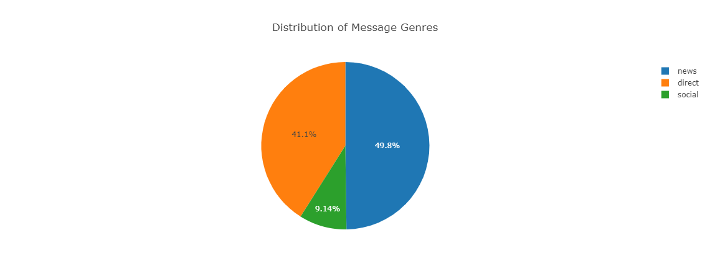
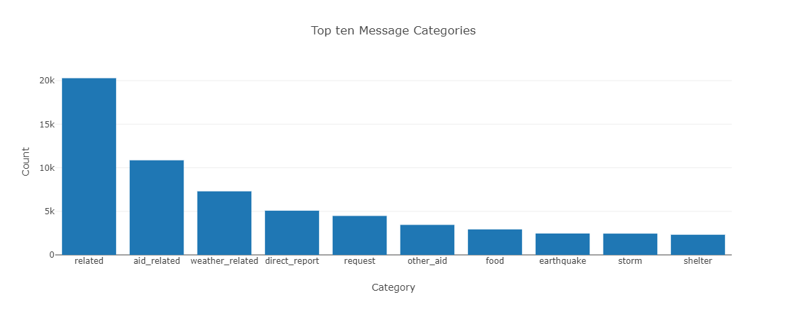
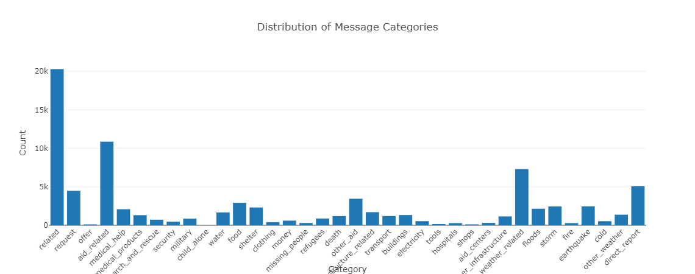
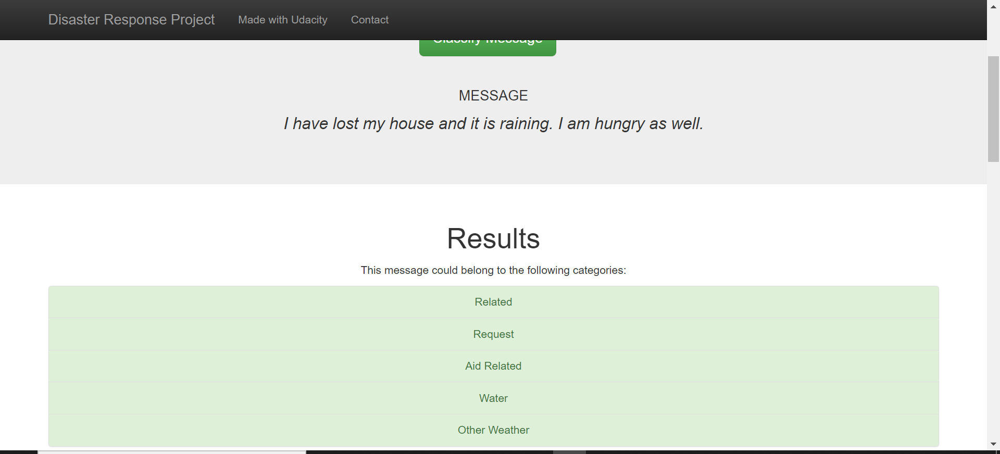

# Disaster Response Pipeline Project
## by Iman Babaei
date: 06.10.2022

### Instructions:
1. Run the following commands in the project's root directory to set up your database and model.

    - To run ETL pipeline that cleans data and stores in database
        `python data/process_data.py data/disaster_messages.csv data/disaster_categories.csv data/DisasterResponse.db`
    - To run ML pipeline that trains classifier and saves
        `python models/train_classifier.py data/DisasterResponse.db models/classifier.pkl`

2. Run the following command in the app's directory to run your web app.
    `python run.py`

3. Go to http://0.0.0.0:3001/

### Clarification 

- First I used the ["ETL Pipeline Preparation.ipynb"](https://github.com/ImiGit/disaster-response-pipeline-project/blob/main/data/ETL%20Pipeline%20Preparation.ipynb) Jupyter notebook template provided by Udacity to make the ETL pipeline, step by step. I have made comments and clarification in the notebooks.

- Then, the [process_data.py](https://github.com/ImiGit/disaster-response-pipeline-project/blob/main/data/process_data.py) is completed, so it can be run as:
        `python data/process_data.py data/disaster_messages.csv data/disaster_categories.csv data/DisasterResponse.db`

- Third step was to write ML pipeline. Similar to ETL one, [ML Pipeline Preparation.ipynb](https://github.com/ImiGit/disaster-response-pipeline-project/blob/main/models/ML%20Pipeline%20Preparation.ipynb) Jupyter notebook provided by Udacity was used. Different classification algorithms were tested and evaluated and SGDClassifier was chosen at the end, based on the classification metrics and speed.

                            | Precision | recall | f1-score |
                            | --- | --- | --- |
                            | 0.94 | 0.95 | 0.94| 

The best model is saved as a pickle file. For further notes about the algorithms and parameters, you can refer to the [ML Pipeline Preparation notebook](https://github.com/ImiGit/disaster-response-pipeline-project/blob/main/models/ML%20Pipeline%20Preparation.ipynb)

- [train_classifier.py](https://github.com/ImiGit/disaster-response-pipeline-project/blob/main/models/train_classifier.py) is completed using the results of the ML Pipeline notebook.

- [run.py app](https://github.com/ImiGit/disaster-response-pipeline-project/blob/main/app/run.py) is modified, so it can access the database and model and run some commands to illustrate the data using flask and plotly. Below you can see three snapshots of these modifications.

- Last, I changed the [go.html file](https://github.com/ImiGit/disaster-response-pipeline-project/blob/main/app/templates/go.html) in the templates a bit, so that it shows all the categry results of the model first, and then below that shows all the possible categories and positive results of the model.

